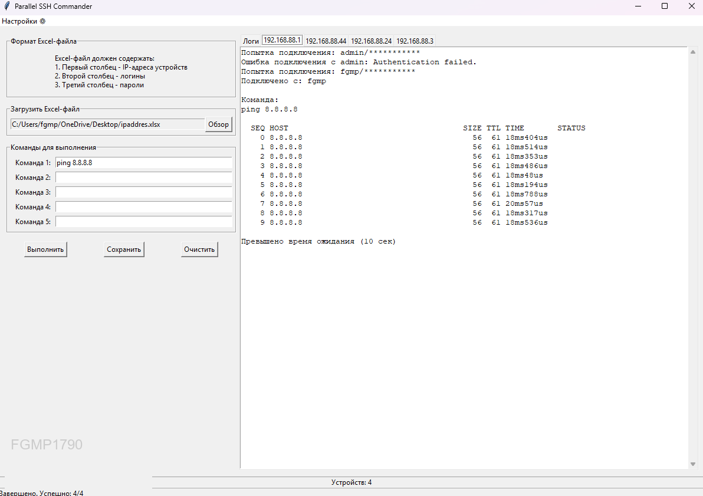

# 🚀 Parallel SSH Commander

<div align="center">
  
  
  [](https://python.org)
  [](LICENSE)


  Создано с ❤️ для эффективного управления сетями
</div>

## ✨ Возможности

- ⚡ **Параллельное выполнение** - до 15 одновременных подключений
- 🔑 **Автоподбор учетных данных** из Excel-файла
- 📊 **Реальный вывод** результатов команд (ping, traceroute и др.)
- 💾 **Сохранение отчетов** в красивом формате
- 🎨 **Графический интерфейс** с водяным знаком

## 🛠️ Требования

- Python 3.7+
- Библиотеки: `paramiko`, `pandas`, `Pillow`, `openpyxl`

## 🚀 Установка

```bash
# Клонирование репозитория
git clone https://github.com/yourusername/parallel-ssh-commander.git
cd parallel-ssh-commander

# Установка зависимостей
pip install -r requirements.txt
🖥️ Использование
📂 Подготовьте Excel-файл в формате:

Copy
IP-адрес    Логин    Пароль
192.168.1.1 admin    password1
192.168.1.2 user     password2
🏃 Запустите программу:

bash
Copy
python ssh_commander.py
🎮 В интерфейсе:

📤 Загрузите Excel-файл

⌨️ Введите команды для выполнения

🚀 Нажмите "Выполнить"

💾 Сохраните результаты кнопкой "Сохранить"

📦 Сборка в EXE
bash
Copy
pyinstaller --onefile --windowed \
            --hidden-import=pandas \
            --hidden-import=paramiko \
            --hidden-import=PIL \
            --add-data="arial.ttf;." \
            ssh_commander.py
🔧 Исправления в текущей версии
🐛 Исправлено: Теперь результаты корректно сохраняются в self.results

📝 Улучшено: Подробные отчеты с цветными статусами (✅/❌)

🕒 Добавлено: Точное время выполнения команд

📜 Лицензия
MIT License - свободное использование и модификация

📬 Контакты
Разработчик: FGMP1790
📧 Email: your.email@example.com
💬 Telegram: @yournickname


<div align="center"> <sub>Создано с ❤️ для эффективного управления сетями</sub> </div>
<div align="center">
  Создано с ❤️ для эффективного управления сетями
</div>
